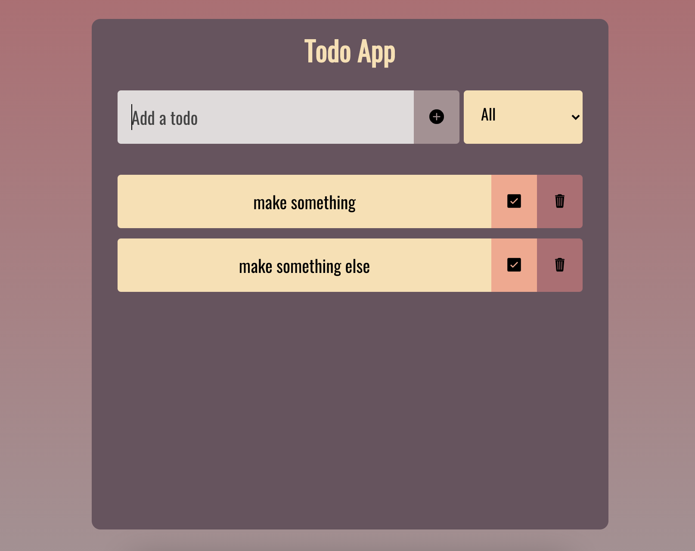

# Todo App

Todo App is a simple react todo app.

## Description

Todo App is a simple todo app built with react. This project is utilizing functional components as well as react hooks.

The purpose of building this project was to acquire and consolidate knowledge concerning React framework.



## Technologies

- [React](https://reactjs.org/) version: 17.0.2
- [react-icons](https://react-icons.github.io/react-icons/) version: 4.3.1

## Features

- Add and delete todos
- Check todo as a complete
- Select completed, uncompleted or all todos
- Save and retrieve todos from local storage

## Setup

In order to get a copy of this project and run it locally, first of all, make sure you already have node and npm installed in your system.

Clone this repository

```bash
$ git clone https://github.com/RadoslawZemlo/todo-react.git
```

After cloning the repo, go to its root directory and install dependencies

```bash
$ cd todo-react
$ npm install
```

Once the dependencies are installed, start the application

```bash
$ npm start
```

Then you will have access to application on **localhost:3000**
